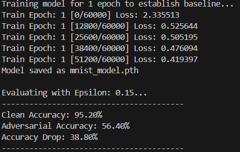
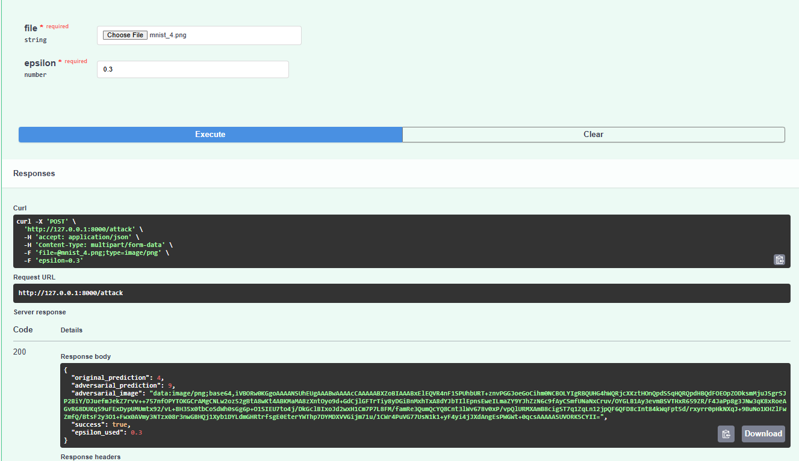
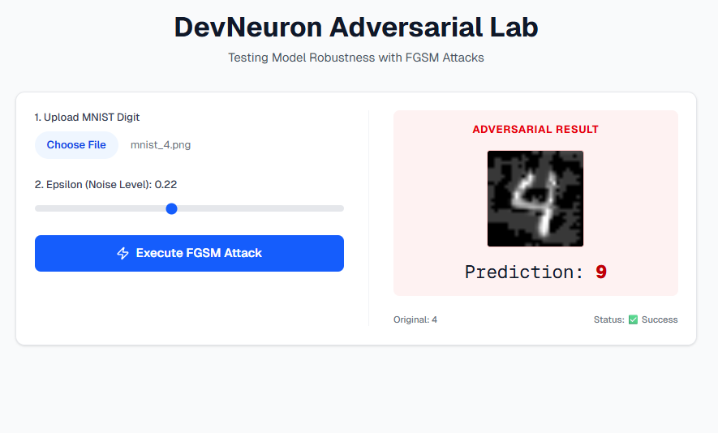
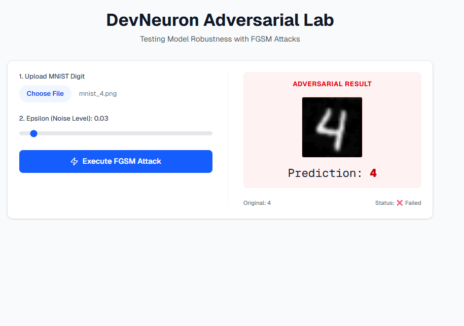

# 🧠 DevNeuron Adversarial Lab: FGSM Robustness Analysis

This repository contains a full-stack implementation of an Adversarial Machine Learning lab. The project demonstrates the vulnerability of a Convolutional Neural Network (CNN) to the **Fast Gradient Sign Method (FGSM)**.

## 🚀 Project Overview
The system allows users to upload handwritten digits (MNIST), apply varying levels of adversarial noise ($\epsilon$), and observe how the model's prediction changes despite the image remaining recognizable to the human eye.

### 🏗️ Architecture
* **ML Core:** PyTorch-based CNN.
* **Backend:** FastAPI server providing a REST API for real-time FGSM attacks.
* **Frontend:** Next.js dashboard for interactive testing and visualization.
* **Deployment:** Architected for AWS (Amplify + Lambda + API Gateway).











---

## 🛠️ Installation & Setup

### 1. Backend (Python 3.9+)
```bash
# Navigate to backend
cd backend

# Install dependencies
pip install -r requirements.txt

# Train model and generate weights (mnist_model.pth)
python test_fgsm.py

# Start the API server
uvicorn app_fgsm:app --reload